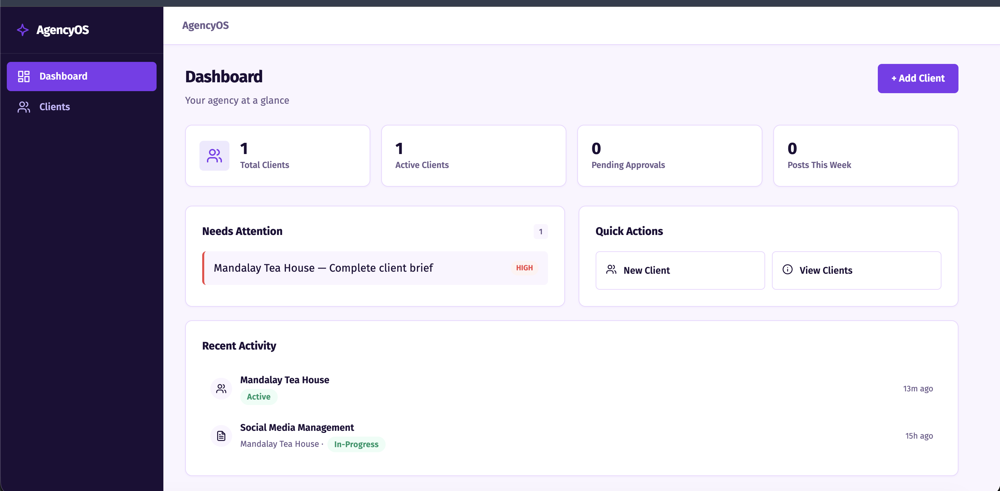
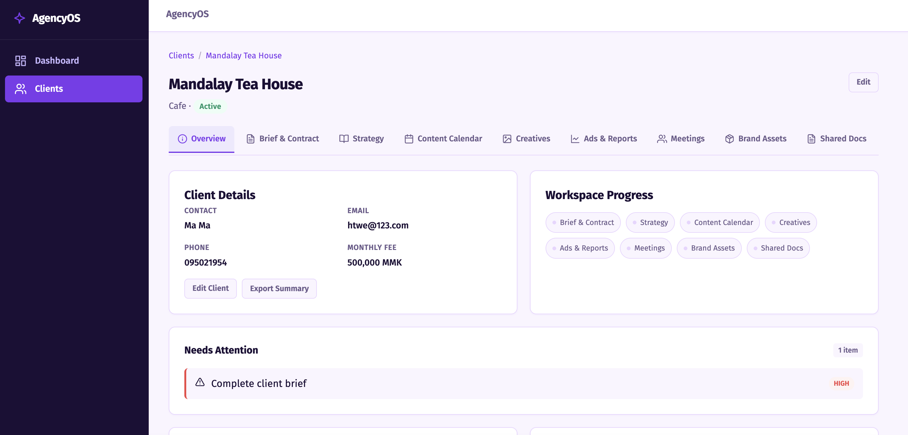
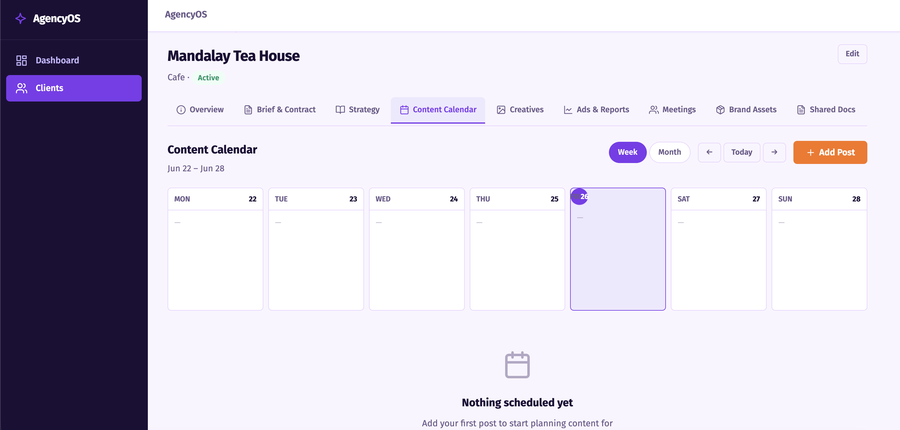

# ch-4 Personal Project — Report

github_username: rover-aungkhine
personal_repo_url: https://github.com/rover-aungkhine/mini-ai-marketing-agency
live_url: https://rover-aungkhine.github.io/mini-ai-marketing-agency/
license: MIT
project_summary: A browser-only agency management dashboard with client CRM, content calendar, creative tracking, and AI-powered marketing content generation — no backend, no framework, no API key.
slides_url: slides/pitch.md

## Product-Intro Slides

- **Slides path:** slides/pitch.md

## Demo Screenshots

- **Resolution used:** 1280×800 desktop





## Notes

**How to run locally:**
```bash
python3 -m http.server 8000
# Open http://localhost:8000
```

**Demo data:** The app auto-seeds 3 sample clients (Golden Bites Bakery, Skyline Tech, Lotus Wellness) with full workspace data on first load — calendar posts, creatives, campaigns, meetings, brand assets, and shared docs.

**What it does:**
- Dashboard with real-time stats and action queue
- Client CRM with 9-tab workspace (Brief, Strategy, Calendar, Creatives, Ads, Meetings, Assets, Docs)
- Content calendar with week/month views and status tracking
- Rule-based marketing content generator (English + Burmese)
- Purple/orange design system with Fira Sans typography
- Fully client-side — uses localStorage, no server needed

**Tech stack:** Vanilla JavaScript ES modules, HTML, CSS. No frameworks, no build step, no dependencies.

**Known rough edges:**
- localStorage-only (data resets if browser cache is cleared)
- No data export/import yet
